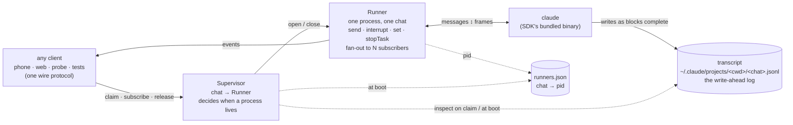
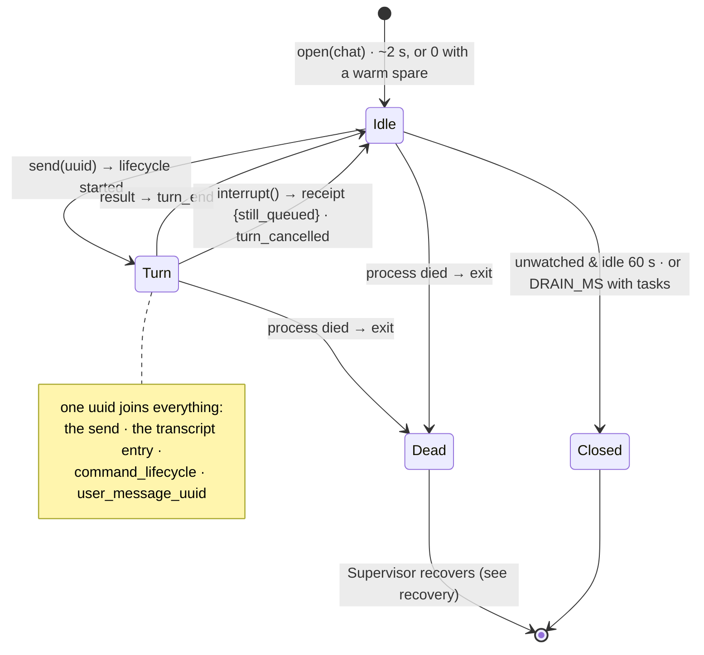
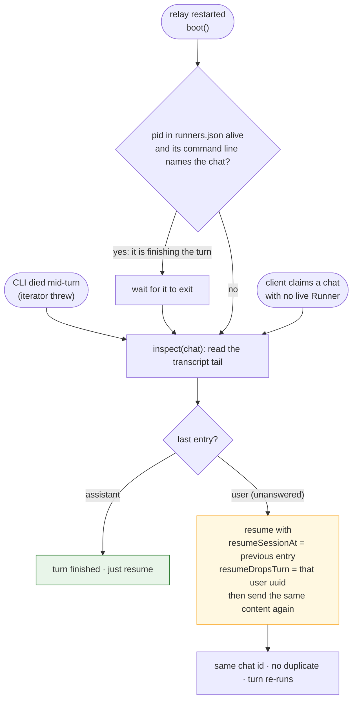

# Claude Code session orchestration: what the SDK is, and the smallest reliable design on top of it

Written 2026-09-03 against `@anthropic-ai/claude-agent-sdk` 0.3.259, which bundles Claude Code 2.1.259.
Every fact marked **(probe N)** was measured with the scripts in `.probe/` against `/tmp/probe-cwd`.
Everything else is read from `node_modules/@anthropic-ai/claude-agent-sdk/sdk.d.ts`.

## 1. The SDK, as a mental model

The SDK is a wrapper around one `claude` subprocess. There are four things it deals in, and only one of them survives a crash.

### 1.1 The session is the durable thing

A session is a JSONL transcript on disk under `~/.claude/projects/<cwd-key>/<sessionId>.jsonl`. It is keyed by the working directory plus a UUID.

- **You can name it before it exists.** `query({ options: { sessionId } })` — the first frame back carries that id. **(probe 1)**
- It is managed by plain functions that take `{ dir }`: `listSessions`, `getSessionInfo`, `getSessionMessages`, `forkSession`, `tagSession`, `renameSession`, `deleteSession`. `chats.ts` already uses these.
- **What gets written when.** The user message is written the moment it is submitted, before any reply. Each assistant block is written when that block completes. An interrupt writes a synthetic user entry `[Request interrupted by user]`. **(probes 2, 5)**
- **What a hard kill loses.** If the CLI process is killed with SIGKILL mid-block, the in-flight block is gone. The transcript ends with the user message and nothing after it. **(probes 2, 4)**
- **Resume alone does nothing.** Resuming a transcript whose last entry is an unanswered user message and sending nothing spawns no process and emits no frame. The CLI does not re-drive a dangling turn. **(probe 3)**
- **A dangling turn can be cut off and redone without a fork.** `resume` + `resumeSessionAt: <last entry of the kept turn>` + `resumeDropsTurn: <dangling user uuid>`, then send the instruction again: the dead entry is removed, the same session id is kept, no duplicate. **(probe 4)** A refusal (`Resume rejected by --resume-drops-turn:`) is deterministic; never retry it.
- `systemPrompt.snapshot: true` (new in 0.3.259) records the system prompt in the transcript and reuses it on resume, so the prompt cache prefix survives a restart and the `append` cannot drift mid-conversation.

### 1.2 The process is a view onto a session

`query()` starts one CLI subprocess. It is the SDK's own binary at `node_modules/@anthropic-ai/claude-agent-sdk-darwin-arm64/claude`, not the `claude` on PATH. **(probe 8)** Credentials come from `~/.claude`, which both share.

- Spawn costs about 2.1 s. `startup()` pre-spawns; `warm.query()` then initialises in 0 ms. **(probe 6)**
- Spawn is lazy: a resumed query with nothing to send never spawns. **(probe 3)**
- `spawnClaudeCodeProcess` hands you the `ChildProcess`, so a supervisor can hold the pid. It also hands you the whole spawn, `cwd` included: a hook that passes `options` through unexamined can still land the child in the parent's directory, and the transcript then goes under the wrong project key, where `getSessionMessages(chat, { dir })` reads it as empty. Spread `cwd` in explicitly. **(probe 9)**
- **Death is a thrown error.** SIGKILL on the CLI makes the `for await` loop throw `Claude Code process terminated by signal SIGKILL`. **(probe 2)**
- **`close()` kills the whole tree**, background tasks and their children included. **(probe 6)**
- **An orphan finishes its turn.** If the relay (the Node parent) dies, the CLI sees stdin EOF, completes the turn it is on however long that takes (21 s in the test, inside a tool call), writes it to the transcript, kills its background tasks, and exits. The result frame goes to a dead pipe, so nobody is told. **(probes 7, 8)**

### 1.3 The turn has one join key

A turn is one user send and one `result`. The uuid the caller puts on the send is the transcript entry's uuid, the `command_uuid` on `command_lifecycle` frames, and the `user_message_uuid` on the first reply frame and on the result. **(probes 2, 5)**

- `command_lifecycle` frames (capability `msg_lifecycle_v1`) carry `state: queued | started | completed | cancelled`. They are emitted by the CLI but are **not in the SDK's `SDKMessage` type**; they pass through untyped. **(probe 5)**
- `interrupt()` returns a receipt: `{ still_queued: string[] }`, the uuids of sends that will still run. A send queued behind an interrupted turn runs next, with its own lifecycle frames. **(probe 5)** The interrupted turn's result is `error_during_execution` with `terminal_reason: 'aborted_streaming'`.
- Several sends made close together may run as one turn; `user_message_uuids` on the first reply frame lists all of them.
- `total_cost_usd` on a result is cumulative for the `query()` call and resets on resume. A turn's cost is the difference between two results.
- An `assistant` frame cut by an interrupt carries `aborted: true`.
- Turns nobody sent exist: after a background task settles, the CLI narrates it in a turn with no uuid.

### 1.4 The background task belongs to the process

- `task_started`, `task_updated`, `task_notification` are edges; `background_tasks_changed` is the level (replace your set with its payload). **(probe 6)**
- `stopTask(taskId)` works: `task_updated { status: 'killed' }` then `task_notification { status: 'stopped' }`. **(probe 6)** The comment in `claude.ts` saying a task can only be stopped by asking the model is wrong.
- `backgroundTasks(toolUseId?)` pushes a blocking foreground tool to the background and lets the turn continue.
- With `perTaskStopAffordance: true` an interrupt spares background tasks; without it, an interrupt kills them.
- Nothing about a task is persisted. A task is lost whenever its process ends, and the process ends on `close()`, on a CLI crash, and after the orphan finishes its turn. This is the ceiling on recovery: a crash loses tasks, and the best the orchestrator can do is know it and say so.

### 1.5 Mid-session controls

`setModel`, `setPermissionMode` (reaching `bypassPermissions` needs `allowDangerouslySkipPermissions` at spawn), `applyFlagSettings({ effortLevel })`, `stopTask`, `backgroundTasks`, `interrupt`, `reinitialize` (for reattaching after a transport gap), `rewindFiles` (needs `enableFileCheckpointing`), `getContextUsage`. `permissionPrompts: 'none'` (new) makes a prompt that nobody can answer fail immediately with a message to Claude instead of hanging. `canUseTool` would let a host answer prompts; the phone does not, today.

### 1.6 What is not there

No `session_state_changed` frame was seen in eight sessions. No `worker_shutting_down` frame either; the docs say it is a remote-bridge signal. Do not build on them.

## 2. Requirements

These are the properties the current code tries to have and does not fully have.

1. **Addressable from birth.** A chat has an id before its first frame, so every client and every log line can name it.
2. **No silent loss.** A turn that was accepted either finishes or is reported as failed, across a CLI crash and across a relay restart.
3. **Any number of observers, any time.** Attaching mid-turn shows the current state — the transcript up to the last completed block — then streams live. No replay buffer.
4. **Barge-in is exact.** Interrupt stops a turn without losing the session; queued sends are known from the receipt, not guessed from frame order.
5. **Process policy in one place.** Idle processes are reaped, busy ones kept, and an observer leaving never kills a background task.
6. **Mid-session settings** hold from the next turn (already true).
7. **Every turn is recorded** with its timings and cost (already true, `turns.jsonl`).

## 3. Design

Three parts. Two are code, one is a small file. Nothing else is needed.

### 3.1 Runner: one process, one chat

`runner.ts`. Wraps `query()`. Owns the `ChildProcess`, the input generator and the frame loop. Knows nothing about sockets, voice or the phone.

```
open(chat, { resume, truncate? }) → Runner

Runner
  chat            the session id, fixed from birth
  pid
  turn            the open turn, or null: { uuid, ambient, events[] }
  tasks           Map<taskId, description>          (replace on background_tasks_changed)
  subscribe(fn)   → unsubscribe                      (fan-out; a new subscriber gets turn_started if a turn is open, then live)
  send(uuid, content)
  interrupt()     → { still_queued }
  set(model?, permission?, effort?)
  stopTask(id)
  close()
```

Events, one union, derived directly from frames:

| Event | From |
|---|---|
| `turn_queued { uuid }`, `turn_started { uuid }`, `turn_cancelled { uuid }` | `command_lifecycle` |
| `block { kind }` | `stream_event content_block_start` |
| `text { delta }` | `stream_event delta.text` |
| `tool_start { id, name, parent }`, `tool_end { id, parent }` | `assistant tool_use`, `user tool_result` |
| `tasks { set }` | `background_tasks_changed` |
| `task_done { id, status, summary }` | `task_notification` |
| `turn_end { uuid, cost, error, terminal_reason, model, permission, effort }` | `result` |
| `exit { reason }` | loop ended or threw |

Frames arriving while no turn is open (a narration after a task) open an ambient turn with `uuid: null`. The `wanted`/`stamps`/`streaming` fence goes away: the lifecycle frames and `user_message_uuid` say which turn a frame belongs to.

The runner spawns with: `sessionId` or `resume`, `systemPrompt: { preset: 'claude_code', append, snapshot: true }`, `includePartialMessages`, `permissionMode`, `allowDangerouslySkipPermissions`, `perTaskStopAffordance`, `permissionPrompts: 'none'`, `settingSources: ['project']`, `allowedTools`, `disallowedTools`, `spawnClaudeCodeProcess` (to hold the pid), `env`.

### 3.2 Supervisor: the registry and the policy

`orchestrator.ts`. A `Map<chat, Runner>` and the only place that decides when a process lives or dies.

```
claim(chat?)            → Runner     mint a uuid if none; reuse a live runner; else inspect → recover if needed → open
release(chat, observer)               unsubscribe; then apply policy
working()               → Set<chat>  chats with an open turn or live tasks   (replaces live.ts)
watch(fn)                             called when working() changes
boot()                                run once at startup, see 3.4
```

Policy, all in `release` and in the runner's `exit` handler:

- **No observers, idle** (no open turn, no tasks): close after a short keep-warm (60 s), because a reopen costs 2 s and the phone reconnects constantly.
- **No observers, busy**: keep. Cap at `DRAIN_MS` as today, because a runaway task with nobody watching should not live forever. This is what "New chat" while a turn runs means: the turn and its tasks continue, the answer lands in the transcript, and `state` on that chat says so to the drawer.
- **Runner exits with a turn open, observers attached**: `claim` again at once. The transcript is dangling, so this is the recovery path of 3.3, and the observers see `turn_started` again on the same instruction.
- **Runner exits with a turn open, nobody attached**: leave it. The next `claim` recovers it.
- **Warm spare**: keep one `startup()` handle ready for the next fresh chat. Optional; 2 s saved per new conversation.

### 3.3 Recovery: the transcript is the write-ahead log

There is no journal. The CLI writes the user message at submit, so the transcript already records every accepted send. Recovery is reading it back.

```
inspect(chat):
  entries = getSessionMessages(chat, { dir })
  last    = the final user or assistant entry
  dangling if last.type === 'user'
           and it is not a tool_result carrier
           and it is not the synthetic '[Request interrupted by user]'
  → { uuid: last.uuid, content: last.message.content, prev: entry before it | null }

recover(chat, d):
  if d.prev:  open(chat, { resume: chat, resumeSessionAt: d.prev.uuid, resumeDropsTurn: d.uuid })
              send(newUuid, d.content)
  else:       the very first message is dangling — see open item 1
```

The content re-sent is exactly what was sent before, pictures included, because the transcript holds the content blocks. Each re-drive is a new turn record in `turns.jsonl`, marked as a recovery.

### 3.4 Boot, and the one file

At startup the relay does not know whether an orphan CLI from the previous run is still finishing a turn (probes 7 and 8: it can be, for as long as the turn takes). Inspecting a transcript that is still being written would misread it. So the runner records its pid.

`.duck-talk/runners.json`: `{ [chat]: { pid, startedAt } }`, written on spawn, removed on exit. At boot:

1. For each entry whose pid is alive **and** whose command line names that chat (`ps -o command -p <pid>` contains `--session-id <chat>` or `--resume <chat>`): wait for it to exit. It is finishing the user's turn; killing it would lose the in-flight block.
2. Then `inspect` each listed chat. Dangling → `recover` (eager; the user pressed send and expects it to finish). Not dangling → the orphan completed the turn; the phone will see the answer when it reopens the chat.
3. Delete the file.

The command-line check is what makes a stale pid harmless: a reused pid belongs to some other program and fails the check.

### 3.5 What the STT/TTS layer sees

`session.ts` is the voice consumer, and it is the only thing that touches Gemini. `claim` returns a handle bound to the **chat**, not to a Runner, so a Runner replaced by recovery is invisible to it.

Voice → orchestrator, five calls: `claim(chat?) → handle` (the id is known at once), `handle.send(uuid, content)`, `handle.interrupt()` (receipt ignored; voice never queues two), `handle.set(model, permission, effort)`, `handle.release()`.

Orchestrator → voice, seven events: `turn_started { uuid, ambient, recovered }`, `block { kind }`, `text`, `tool_start`, `tool_end`, `turn_end`, `error`, `exit` — fired only when the Supervisor gave up recovering, replacing the 300 s silence watchdog — and `state`, the chat's working/recovering snapshot, forwarded to the phone so "Working…" is drawn from the relay's fact and live mode from the mic's. `turn_queued`, `turn_cancelled`, `tasks`, `task_done` are not wired to voice.

Unchanged: `ears`, `voice`, the floor machine, review, readback, keywords, retract, corrections, clips, `played`, the turn record. The phone protocol gains two fields on `turn_start`: `session` and `turn`.

### 3.6 What is removed

- `live.ts`: its two functions are `working()` and `watch()` on the supervisor.
- In `claude.ts`: the pool and its re-keying on first frame; `claim`/`release`/`attach`/`detach`; `tail`; `wanted`, `stamps`, `streaming`, `ambient` as separate flags; the `parked` timers; `inflight()` (becomes `runner.turn.instruction`).
- The "older CLI" fallbacks. The SDK ships its own CLI, so the version is pinned by `package.json`.
- The requirement for `claude` on PATH, once open item 3 is confirmed.

## 4. Diagrams

Three pictures, checked with mermaid-cli; sources in `docs/diagrams/`.

### 4.1 Who talks to whom

Only the Runner talks to the SDK. Only the Supervisor decides whether a process lives. Every client is a subscriber, and the transcript on disk is the write-ahead log.



### 4.2 What a Runner does over its life



### 4.3 How a lost turn comes back

Three ways in, one path. The transcript already holds every accepted send, so recovery is reading it back.



## 5. Interfaces

### 5.1 Supervisor (`orchestrator.ts`)

| Call | Input | Output | Description |
|---|---|---|---|
| `claim(chat?)` | session id, or none | `Runner` | Live runner if one exists. Otherwise mint a uuid (none given) or `inspect` the transcript (given): dangling → `recover`, else open with `resume`. Never spawns a second process onto one chat. |
| `release(chat, subscriber)` | chat, the fn passed to `subscribe` | — | Unsubscribe, then apply policy: idle and unwatched → close after 60 s keep-warm; busy → keep, capped at `DRAIN_MS`. |
| `working()` | — | `Set<chat>` | Chats with an open turn or live background tasks. What the drawer's pill reads. |
| `watch(fn)` | callback | unsubscribe fn | Called whenever `working()` changes. |
| `boot()` | — | `Promise<void>` | Once at startup: wait for orphans named in `runners.json`, inspect their chats, recover dangling turns, delete the file. |
| `inspect(chat)` | chat | `Dangling \| null` | Reads the transcript tail. `Dangling = { uuid, content, prev: uuid \| null }`. |
| `recover(chat, dangling)` | | `Runner` | Truncating resume plus re-send of the same content. Marks the turn record as recovered. |

### 5.2 Runner (`runner.ts`)

| Call | Input | Output | Description | SDK underneath |
|---|---|---|---|---|
| `open(chat, opts)` | `{ resume: boolean, truncate?: { at, drops } }` | `Runner` | Spawn one process for one chat. `truncate` is the recovery pair. | `query({ sessionId \| resume, resumeSessionAt, resumeDropsTurn, spawnClaudeCodeProcess, … })` |
| `subscribe(fn)` | `(e: Event) => void` | unsubscribe fn | Emits `turn_started` if a turn is open, then streams live. Nothing is replayed: the subscriber loads the transcript, which holds every completed block. | — |
| `send(uuid, content)` | caller-minted uuid; string or content blocks (text + base64 JPEG) | — | One turn. The uuid is the join key everywhere. | yields `SDKUserMessage { uuid }` into the input generator |
| `interrupt()` | — | `{ still_queued: uuid[] }` | Stop the running turn. Session and background tasks survive. Queued sends run next unless cancelled. | `q.interrupt()` |
| `set(model?, permission?, effort?)` | any subset | `Promise<void>` | Holds from the next turn. A refused change is reported as an `error` event and the old value kept. The next `send` waits for it. | `setModel`, `setPermissionMode`, `applyFlagSettings({ effortLevel })` |
| `stopTask(id)` | task id from `tasks`/`task_done` | `Promise<void>` | Kill one background task. | `q.stopTask` |
| `close()` | — | — | End the process and every task in it. Only the Supervisor calls this. | `q.close()` |
| `chat`, `pid`, `turn`, `tasks` | — | fields | `turn = { uuid \| null, instruction, events[] }`; `tasks = Map<id, description>`. | — |

### 5.3 Events (what every subscriber receives)

| Event | Fields | Meaning | Source frame |
|---|---|---|---|
| `turn_queued` | `uuid` | The CLI accepted the send. | `command_lifecycle queued` |
| `turn_started` | `uuid`, `instruction`, `ambient` | The turn is running. `ambient: true` for a narration nobody sent (`uuid` null). | `command_lifecycle started`, or first frame with no turn open |
| `block` | `kind` | First content block of the turn: `text`, `thinking`, `tool_use`. Once per turn. | `stream_event content_block_start` |
| `text` | `delta` | Reply text. | `stream_event delta.text` |
| `tool_start` | `id`, `name`, `parent` | A tool began. `parent` is the Agent call it runs inside, null for Claude's own. | `assistant tool_use` |
| `tool_end` | `id`, `parent` | That tool finished. | `user tool_result` |
| `tasks` | `set: {id, description}[]` | The live background tasks, replace semantics. | `background_tasks_changed` |
| `task_done` | `id`, `status`, `summary` | A task settled: `completed`, `failed`, `stopped`. | `task_notification` |
| `turn_end` | `uuid`, `cost`, `error`, `terminal_reason`, `model`, `permission`, `effort` | The turn is over. `cost` is this turn's share of the running total. | `result` |
| `turn_cancelled` | `uuid` | The turn was interrupted; follows its `turn_end`. | `command_lifecycle cancelled` |
| `state` | `working`, `turn`, `tasks`, `recovering` | The chat's state, as a snapshot on attach and again on every change. What the home screen's "Working…" pill and the drawer's pill read; replaces the phone's `follow()` 3 s guess. Independent of whether any mic is live, which is the phone's own fact. | derived from `turn_started`/`turn_end`/`tasks`/recovery |
| `error` | `text` | Something between turns failed, such as a refused `set`. | SDK rejection |
| `exit` | `reason` | The process is gone: `closed`, `signal:SIGKILL`, `error:<msg>`. Last event a runner emits. | loop ended or threw |

### 5.4 Phone-facing frames that change

| Frame | Today | After |
|---|---|---|
| `turn_start` | no fields | `session` (chat id), `turn` (uuid) — known at `claim`, not only at `turn_end` |
| `interrupted` | `retract?` | plus `turn` (uuid), so the phone drops the right lines by id |
| `chats[].working` | from `live.ts` | from `state.working`; also `recovering: true` while a re-drive is in flight |
| `state` | none; the phone guesses with `follow()` and a 3 s timer | `{ working, turn, tasks, recovering }` on attach and on change, for the home screen's "Working…" pill |

## 6. Open items

1. ~~**First message dangling.**~~ Answered: `deleteSession(chat, { dir })` then `open` with the same `sessionId` and a re-send. The id is kept, the transcript comes back clean — one user entry, then the reply, no duplicate — and `getSessionMessages` reads empty in between. **(probe 9)** So recovery has one shape after all: with a `prev` entry, truncate; without one, delete. (A `deleteSession` on a chat whose file is missing throws `Session <id> not found`, so the delete belongs behind the `inspect` that found the dangling entry.)
2. **Narration turns and lifecycle frames.** The types say uuid-less commands such as task notifications produce no lifecycle frame. Confirm that an ambient turn shows no `command_lifecycle`, so the runner's "frames with no open turn" rule is the right one.
3. ~~**`claude` on PATH.**~~ Answered by reading: nothing in `server/` shells out to `claude`. The only `execFile` callers are `lab.ts` and `probe.ts` (`say`, `afconvert`) and `reach.ts` (`tailscale`), and the SDK spawns its own bundled binary. What the README must still ask for is the *login*, not the binary: credentials come from `~/.claude`, so "Claude Code, signed in" stays and "on your PATH" goes.
4. **`snapshot: true` and the phone-edited prompt.** With the prompt recorded per conversation, an edit reaches only new chats, not the next session of an existing chat. `prompts.ts` says "takes effect the next time you press listen"; that text must change.
5. **`inspect` cost at boot.** `getSessionMessages` reads the whole file. Only chats listed in `runners.json` are inspected, so this is a handful, not the drawer's 200.
6. **`interrupt()` and `cancel_queued`.** The typed method takes no argument. If a stop button must also drop queued sends, that needs the raw control request or a per-uuid `cancel_async_message`.
